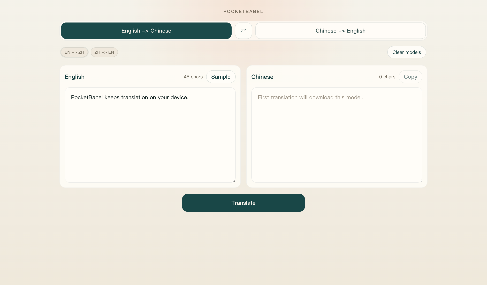

# PocketBabel

PocketBabel is a frontend-only English/Chinese translation app built with [`@huggingface/transformers`](https://github.com/huggingface/transformers.js). It runs entirely in the browser, targets Cloudflare Pages, and is designed to keep working offline after model download.



## Demo

[pocketbabel.minifish.org](https://pocketbabel.minifish.org/)

## Highlights

- English -> Chinese and Chinese -> English only
- No backend inference service
- Works on desktop and mobile browsers
- PWA shell with offline reuse after model download
- Built for a simple, self-explanatory translation workflow

## Project status

PocketBabel is an early v1-focused project. The current product scope is intentionally narrow:

- English -> Chinese with `Xenova/opus-mt-en-zh`
- Chinese -> English with `Xenova/opus-mt-zh-en`
- No accounts, sync, OCR, speech, or multi-language support

The detailed product guardrails live in [AGENTS.md](AGENTS.md).

## Quick start

```bash
npm install
npm run dev
```

Default local URL:

```text
http://localhost:5173
```

## Build and test

```bash
npm test
npm run build
```

## How offline works

1. Open the app while online.
2. Download a direction once, or run a successful translation for that direction.
3. Re-open the app later on the same browser profile.
4. Use the downloaded direction offline.

Expected behavior:

- Downloaded directions continue to translate offline.
- Undownloaded directions fail with a visible error instead of pretending to work.

## Deploy to Cloudflare Pages

PocketBabel is a static site. It does not require Pages Functions or Workers.

### Pages dashboard settings

- Framework preset: `None`
- Build command: `npm run build`
- Build output directory: `dist`
- Root directory: `/`

### Deploy with Wrangler

Preview deploy:

```bash
npm run pages:deploy
```

Production deploy:

```bash
npm run pages:deploy:production
```

If your Pages project name is not `pocketbabel`, update the scripts in [package.json](package.json).

### Cache behavior

- Hashed files under `/assets/` are immutable
- `index.html`, `manifest.webmanifest`, and `sw.js` are `no-cache`
- Cache policy is defined in [public/_headers](public/_headers)

## Browser/runtime notes

- The first model download is relatively large
- Browser support depends on Web Workers, IndexedDB, and Cache Storage
- Model files are cached by browser-managed storage used by `transformers.js`, not `localStorage`

## Contributing

See [CONTRIBUTING.md](CONTRIBUTING.md) before opening a pull request.

## Security

See [SECURITY.md](SECURITY.md) for vulnerability reporting guidance.

## License

This repository is licensed under the GNU AGPL v3. See [LICENSE](LICENSE).
